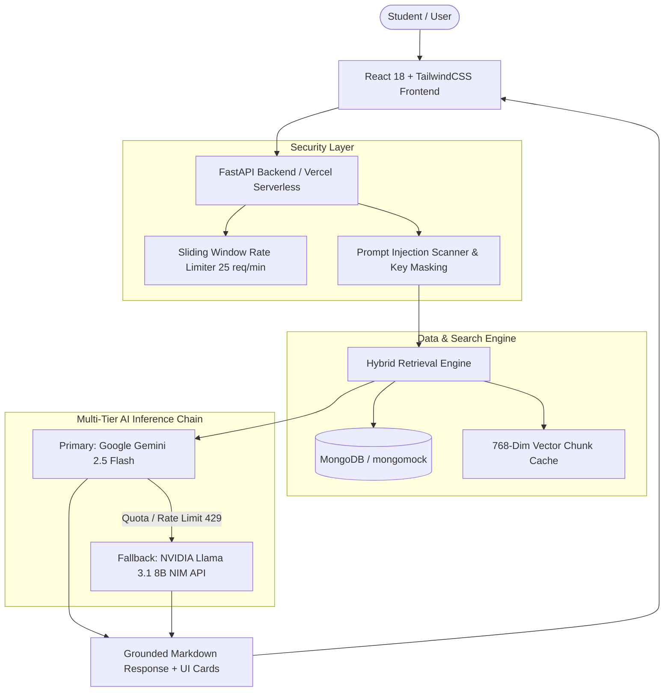

# 🎓 Campus AI — Grounded Placement Intelligence Command Center

> **A student-first, zero-hallucination placement companion powered by RAG, MongoDB hybrid search, multi-tier LLM failover architecture, and system-aware dark mode.**


---

## 📖 The Story Behind Campus AI

Every year, millions of graduating engineering students face the high-stakes pressure of campus placement season. But instead of focusing on technical preparation, students find themselves buried under:

* 📄 **Opaque PDF brochures** with conflicting eligibility criteria.
* ❓ **Unclear CGPA cutoffs** and hidden active/dead backlog restrictions.
* 💸 **Confusing compensation breakdowns** (Fixed vs. Performance Bonus vs. ESOPs).
* 🚨 **Generic AI Hallucinations**: Standard LLMs routinely invent fake salaries or misquote branch eligibility rules when asked placement queries.

**Campus AI** was built to solve this exact problem. 

Designed around the **Swiss Brutalist / Performance Pro** aesthetic, Campus AI is an enterprise-grade placement intelligence platform that ingests raw placement brochures, normalizes 115+ company drives across batches, and provides **100% grounded answers backed by source citations (`[Doc N]`)**. If a fact is not in the verified placement dataset, Campus AI explicitly declines to guess.

---

## ✨ Core Features & Platform Modules

Campus AI is a **mobile-first** app (bottom tab navigation + floating AI assistant button) offering **6 interconnected placement tools** and a **system-aware dark mode** toggle:

| Tool | Route | Description |
|---|---|---|
| **📊 Placement Command Dashboard** | `/` | Live stats (total companies, avg/max CTC, drives per batch) plus recharts visualizations — company count by batch, top recruiters, role distribution, and CTC distribution buckets. |
| **💬 AI Assistant (RAG Chat)** | `/chat` | The most-used module: hybrid retrieval (structured keyword filters + 768-dim Gemini embedding cosine similarity) feeding a streaming `gemini-2.5-flash` answer with interactive company cards and source citations. Messenger-style full-height UI with docked composer and swipeable suggestion chips. |
| **🏢 Company Explorer** | `/companies` | Searchable, paginated table across the 2023-24 and 2025 batches. Filterable by batch, branch, minimum CTC, and search terms, with CTC/name sorting. Batch-wise counts and top-recruiter chips on top. |
| **📇 Company Detail** | `/companies/:id` | Role, CTC, eligibility, branches, selection process, backlog policy and mode — one drive, fully unpacked. |
| **🎓 Personalized Eligibility Auditor** | `/eligibility` | Real-time audit of student CGPA, branch, 10th/12th percentages, and active/dead backlogs. Instantly separates qualifying companies from disqualifying drives with exact refusal reasons — plus a **Marginal band** that flags borderline misses (within 0.5 CGPA or 5% academic marks, or backlog-only rejects) so students know which drives are within reach. |
| **⚔️ Side-by-Side Company Compare** | `/compare` | Pick up to 4 placement drives, compare CTC/role/branches/eligibility in a side-by-side matrix with an AI-generated comparative summary. Horizontally scrollable with a sticky criteria column on mobile. |

---

## 🏗️ System Architecture & Failover Engine



### ⚡ Resilient AI Failover Chain
1. **Tier 1 (Primary)**: `Google Gemini 2.5 Flash` (High speed, structured instruction following).
2. **Tier 2 (Fallback A)**: `Gemini 1.5 Flash` / `Gemini 1.5 Pro`.
3. **Tier 3 (Fallback B - Fail-Safe)**: `NVIDIA Llama 3.1 8B NIM API` (`https://integrate.api.nvidia.com/v1/chat/completions`). Resolves in **< 0.7s** if Gemini free-tier quotas are exhausted.

---

## 🔒 Security & Anti-Hallucination Guardrails

- 🛡️ **Per-Endpoint Sliding Window Rate Limiting**: chat 12, eligibility 20, resume parse 10, compare/gap/interview 5 requests per minute per client IP (global cap 25/min) to prevent API key abuse.
- 🚫 **Prompt Injection Scanner**: Blocks adversarial overrides, system prompt extraction, and jailbreak attempts.
- 🔑 **Log Credential Sanitization**: Regex-masks all API keys (`AQ.********************`) and database connection strings in server logs.
- 🎯 **Strict Grounded Refusal**: Prevents off-topic answers or unverified compensation claims.

---

## 📡 API Reference (Key Endpoints)

| Endpoint | Method | Purpose |
|---|---|---|
| `/api/health` | GET | Service status, model readiness, seed state |
| `/api/dashboard` | GET | Aggregates: totals, avg/max CTC, `by_batch`, `top_recruiters`, `top_roles`, `ctc_buckets`, `branch_coverage` |
| `/api/chat` | POST | Grounded RAG Q&A (optional `stream: true` for SSE) |
| `/api/companies` | GET | List with `q`, `batch`, `branch`, `min_ctc`, `sort` (`ctc_desc`/`ctc_asc`/`name_asc`), `page`, `page_size` |
| `/api/companies/stats` | GET | Totals, avg/max CTC, `by_batch` breakdown, `top_recruiters`, `top_roles` |
| `/api/companies/{id}` | GET | Full detail for one drive |
| `/api/companies/compare` | POST | Compare 2–4 drives, AI comparative summary |
| `/api/eligibility` | POST | Audit by CGPA/branch/10th-12th/backlogs/batch → `eligible` + `marginal` + `ineligible` lists |

AI-heavy endpoints are per-endpoint rate limited (chat 12, eligibility 20, compare/gap/interview 5, resume parse 10 per minute per IP), returning `429` with a `Retry-After` header.

The UI follows the system theme by default and persists a manual light/dark override in the header toggle.

---

## 🚀 Deployment Guide (Vercel + GitHub)

Campus AI is pre-configured for 1-click serverless deployment on **Vercel**.

### 1. Vercel Environment Variables
In your Vercel Project Settings, add the following environment variables:

```env
GEMINI_API_KEY=your_gemini_api_key
NVIDIA_API_KEY=your_nvidia_api_key
NVIDIA_MODEL=meta/llama-3.1-8b-instruct
DB_NAME=campus_ai
MONGO_URL=your_mongodb_connection_uri
```

### 2. Deployment Settings
- **Framework Preset**: `Other`
- **Root Directory**: `./`
- **Build & Output**: Handled automatically by `vercel.json`.

---

## 💻 Local Development Setup

### 1. Prerequisites
- Python 3.11+
- Node.js 18+

### 2. Backend Setup
```bash
cd backend
python -m venv venv
# On Windows:
.\venv\Scripts\activate
# On Linux/macOS:
source venv/bin/activate

pip install -r requirements.txt
python -m uvicorn server:app --host 127.0.0.1 --port 8000
```

### 3. Frontend Setup
```bash
cd frontend
npm install
npm start
```

Access the application at `http://localhost:3000`.

---

## 📄 License

Distributed under the MIT License. See `LICENSE` for more information.
